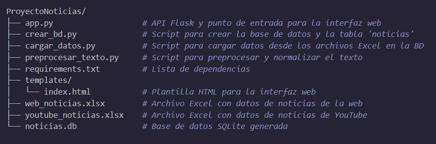

# Proyecto de Noticias

Este proyecto unifica datos provenientes de dos archivos Excel (noticias de YouTube y sitios web) en una base de datos SQLite y expone una API en Flask que permite consultarlos. Además, se incluye una interfaz web simple para buscar noticias y la opción de descargar los resultados en un archivo JSON.


## Descripción del Proyecto

El proyecto tiene los siguientes objetivos:

- **Integrar datos:**  
  Unificar y estructurar la información de noticias provenientes de dos fuentes en una base de datos SQLite. Se crea una tabla `noticias` que almacena campos comunes (fecha, título, resumen) y específicos (por ejemplo, canal para YouTube y medio para Web).

- **Preprocesar el texto:**  
  Se normaliza el contenido (conversión a minúsculas, eliminación de tildes y aplicación de stemming) para facilitar búsquedas y se calcula la frecuencia de las palabras, la cual se almacena en la base de datos.

- **API en Flask:**  
  Se desarrollan endpoints que permiten buscar noticias por tema (ordenando los resultados por la frecuencia de aparición del término) y descargar los resultados en un archivo JSON.

- **Interfaz Web:**  
  Una página web (usando Bootstrap) permite al usuario buscar noticias y visualizar los resultados, además de descargar el JSON.


## Estructura del Proyecto

La estructura del proyecto es la siguiente:




## Requerimientos

- Python 3.7 o superior
- SQLite
- Las siguientes dependencias (instalables con `pip install -r requirements.txt`):
  - Flask
  - pandas
  - openpyxl
  - nltk


## Creación y Uso del Entorno Virtual

Se recomienda utilizar un entorno virtual para aislar las dependencias del proyecto. Para ello, sigue estos pasos:

1. **Crear el entorno virtual:**

   En la raíz del proyecto, ejecuta:
   ```bash
   python -m venv venv
   ```
2. **Activar el entorno virtual:**
- **En windows:**
  ```bash
   venv\Scripts\activate
   ```
  
- **En macOS/Linux:**
  ```bash
   source venv/bin/activate
   ```
   
## Instrucciones de Uso

1. **Instalar Dependencias**

   Ejecuta:
   ```bash
   pip install -r requirements.txt
   
2. **Crear la Base de Datos**

   Ejecuta:
   ```bash
   python crear_bd.py
   
3. **Cargar los Datos**

   Ejecuta:
   ```bash
   python cargar_datos.py
   
4. **Preprocesar el Texto**

   Ejecuta:
   ```bash
   python preprocesar_texto.py
   
5. **Ejecutar la Aplicación Flask**

   Ejecuta:
   ```bash
   python app.py
    ```

6. **Usar la Interfaz Web**

   Abre tu navegador y visita http://127.0.0.1:5000/ para buscar noticias y descargar el JSON.


## Endpoints de la API

### Buscar Noticias

```http
GET /buscar_noticias?tema=<palabra_clave>
```

- Este endpoint devuelve un JSON con las noticias que contienen el término buscado en la columna `texto_normalizado`.  
- Los resultados se ordenan de mayor a menor según la frecuencia de aparición del término en cada noticia.
- Ejemplo de respuesta:
```json
{
  "tema": "economia",
  "noticias": [
    {
      "titulo": "Crisis económica global",
      "fuente": "YouTube (BBC News)",
      "fecha": "2025-03-01",
      "resumen": "Resumen de la noticia..."
    },
    {
      "titulo": "Economía en crisis",
      "fuente": "Web (El Comercio)",
      "fecha": "2025-03-01",
      "resumen": "Resumen de la noticia..."
    }
  ]
}
```

### Descargar Noticias
```http
GET /descargar_noticias?tema=<palabra_clave>
```

Este endpoint descarga un archivo JSON (noticias.json) que contiene la información de las noticias filtradas (sin el campo "resumen").

## Notas Adicionales

**Búsqueda y Normalización:**  
La búsqueda se realiza sobre la columna `texto_normalizado`, la cual se genera aplicando técnicas de normalización (minúsculas, eliminación de tildes y stemming). Además, se calcula y almacena la frecuencia de las palabras en la columna `frecuencias` (en formato JSON) para ordenar los resultados según la relevancia.

**Organización del Código:**  
El proyecto está dividido en varios scripts:
- `crear_bd.py` para la creación de la base de datos.
- `cargar_datos.py` para la importación de datos desde Excel.
- `preprocesar_texto.py` para la normalización y cálculo de frecuencias.
- `app.py` para la API y la interfaz web (con la plantilla en `templates/index.html`).
